# EF — Reporte de Proyecto

**Estudiante:** Alejandro Ramirez
**Proyecto:** Citas Psicológicas
**Repositorio:** https://github.com/alejandroramirezucb/isw-213-project2
**Fecha de entrega:** 20/06/2026

---

## Sección 1 — Deploy

**URL del proyecto:** https://psicoraiden.onrender.com
**Swagger / API:** https://psicoraiden.onrender.com/api-docs/

> Captura del proyecto corriendo con datos reales:

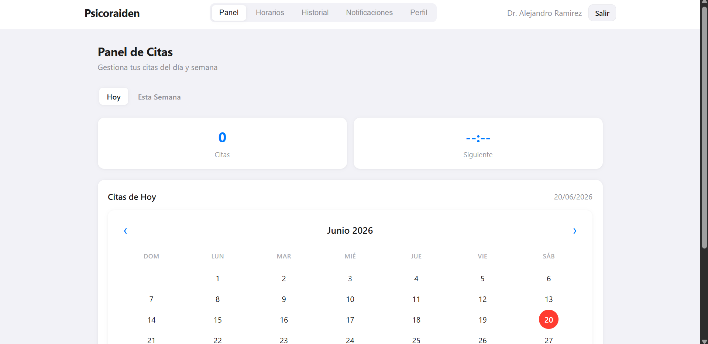

> Captura de la documentación de API (Swagger):

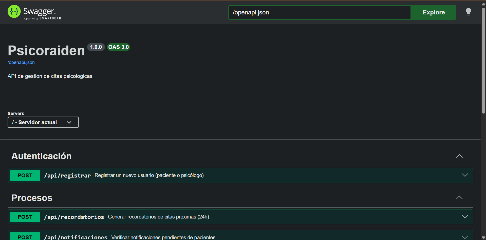

---

## Sección 2 — Pruebas con TDD + cobertura

### Cobertura inicial (0%)

**Herramienta:** Vitest + Istanbul (`@vitest/coverage-istanbul`)

> Captura del reporte de cobertura antes de escribir pruebas nuevas:

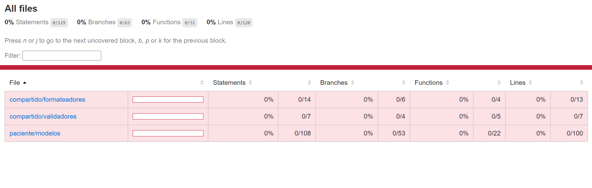

---

### Ciclo TDD — Prueba 1

**HU:** HU-14 Lista de Espera
> Como paciente, quiero entrar a una lista de espera si un día está completamente lleno, para que me avisen si alguien cancela.

**CA elegido:** Dado que un paciente ya está anotado en la lista de espera de un día, cuando intente anotarse de nuevo, entonces el sistema debe detectar que ya está inscrito y no duplicar la inscripción.

**Commit 1 — Rojo** [`1cf8995`](https://github.com/alejandroramirezucb/isw-213-project2/commit/1cf8995):

```
test: [HU-14] agregar test para evitar inscripción duplicada en lista de espera
```
Test escrito (sin el código que lo pase aún):

```javascript
import { describe, test, expect, beforeEach, vi } from 'vitest';
import { ModeloListaEspera } from '../../../../src/cliente/paciente/modelos/ModeloListaEspera.js';
import { capturarEventos } from '../../../helpers/eventos.js';
import { repoListaEspera } from '../../../helpers/dobles.js';

function crearModelo() {
  const repositorio = repoListaEspera();
  const modelo = new ModeloListaEspera(repositorio, {});
  modelo.inicializar('paciente-1');
  return { modelo, repositorio };
}

beforeEach(() => {
  vi.clearAllMocks();
  capturarEventos();
});

describe('Ya esta inscrito en la lista de espera', () => {
  test('retorna true cuando el paciente ya está en la lista', () => {
    // Arrange: inscritos = [{paciente_id:'paciente-9'}, {paciente_id:'paciente-1'}], pacienteId = 'paciente-1'
    const { modelo } = crearModelo();
    const inscritos = [{ paciente_id: 'paciente-9' }, { paciente_id: 'paciente-1' }];

    // Act
    const resultado = modelo.yaEstaInscrito(inscritos, 'paciente-1');

    // Assert
    expect(resultado).toBe(true);
  });

  test('retorna false con lista vacía', () => {
    // Arrange: inscritos = [] (lista vacía), pacienteId = 'paciente-1'
    const { modelo } = crearModelo();

    // Act
    const resultado = modelo.yaEstaInscrito([], 'paciente-1');

    // Assert
    expect(resultado).toBe(false);
  });
});
```

> Captura del test fallando:

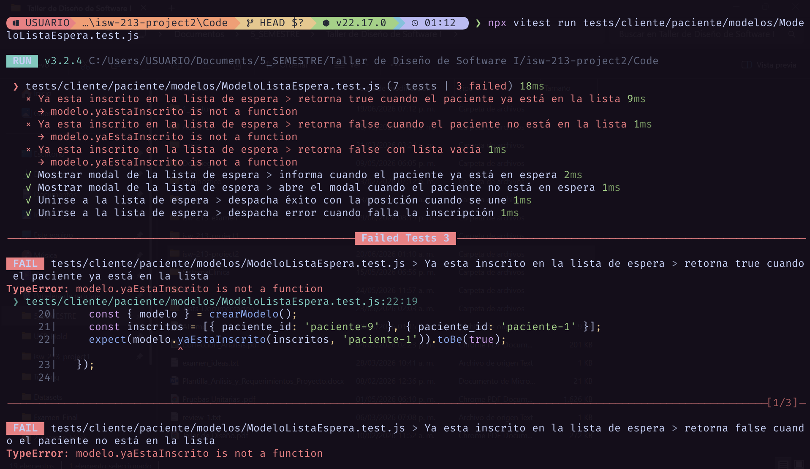

---

**Commit 2 — Verde** [`2503edd`](https://github.com/alejandroramirezucb/isw-213-project2/commit/2503edd):

```
feat: [HU-14] implementar yaEstaInscrito para pasar test
```

Código mínimo para hacer pasar el test:

```javascript
yaEstaInscrito(inscritos, pacienteId) {
  let encontrado = false;
  for (let i = 0; i < inscritos.length; i++) {
    if (inscritos[i].paciente_id === pacienteId) {
      encontrado = true;
    }
  }
  return encontrado;
}
```

> Captura del test pasando:

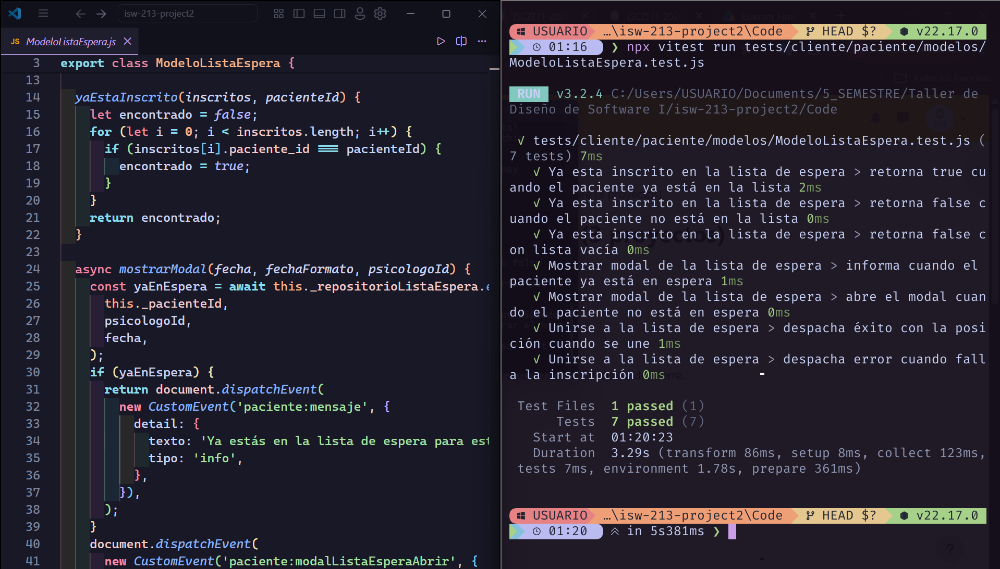

---

**Commit 3 — Refactor** [`a383098`](https://github.com/alejandroramirezucb/isw-213-project2/commit/a383098):

```
refactor: [HU-14] simplificar yaEstaInscrito con Array.some
```

Cambios aplicados:

```javascript
yaEstaInscrito(inscritos, pacienteId) {
  return inscritos.some((inscrito) => inscrito.paciente_id === pacienteId);
}
```

> Captura del test aún pasando después del refactor:

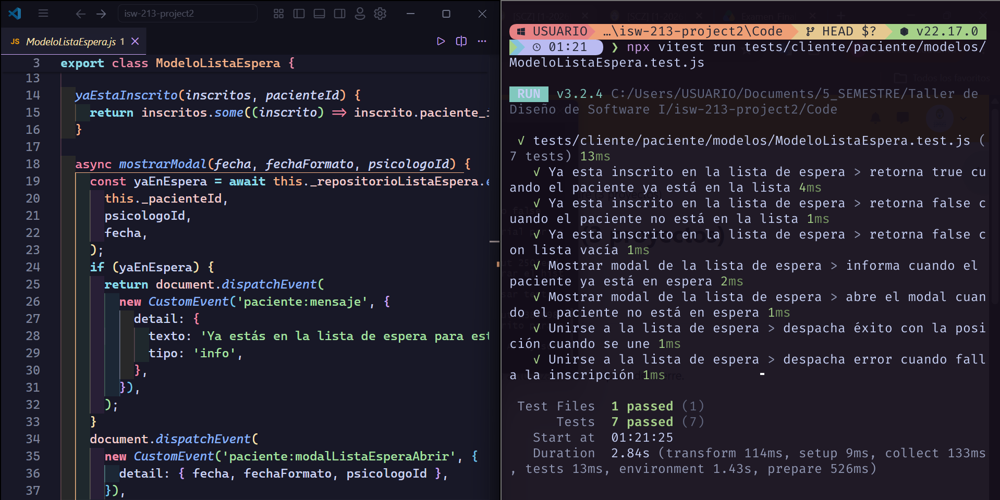

---

### Ciclo TDD — Prueba 2

**HU:** HU-09 Notificación de Confirmación de Reserva
> Como paciente, quiero recibir una notificación al momento de agendar para tener un comprobante y los detalles exactos de mi turno.

**CA elegido:** Dado un conjunto de notificaciones del paciente, cuando el sistema calcule el indicador de no leídas, entonces debe contar únicamente las notificaciones cuyo campo `leida` es falso.

**Commit 1 — Rojo** [`7ee8b09`](https://github.com/alejandroramirezucb/isw-213-project2/commit/7ee8b09):

```
test: [HU-09] agregar test para contar notificaciones no leídas del paciente
```

Test escrito (sin el código que lo pase aún):

```javascript
import { describe, test, expect, beforeEach, vi } from 'vitest';
import { ModeloNotificaciones } from '../../../../src/cliente/paciente/modelos/ModeloNotificaciones.js';
import { capturarEventos } from '../../../helpers/eventos.js';
import { repoNotificaciones } from '../../../helpers/dobles.js';

function crearModelo() {
  const repositorio = repoNotificaciones();
  return { modelo: new ModeloNotificaciones(repositorio), repositorio };
}

beforeEach(() => {
  vi.clearAllMocks();
  capturarEventos();
});

describe('Contar notificaciones no leidas', () => {
  test('cuenta solo las no leídas', () => {
    // Arrange: notificaciones = [{leida:false}, {leida:true}, {leida:false}] 
    const { modelo } = crearModelo();
    const notificaciones = [{ leida: false }, { leida: true }, { leida: false }];

    // Act
    const total = modelo.contarNoLeidas(notificaciones);

    // Assert
    expect(total).toBe(2);
  });

  test('retorna 0 con lista vacía', () => {
    // Arrange: notificaciones = [] 
    const { modelo } = crearModelo();

    // Act
    const total = modelo.contarNoLeidas([]);

    // Assert
    expect(total).toBe(0);
  });
});
```

> Captura del test fallando:

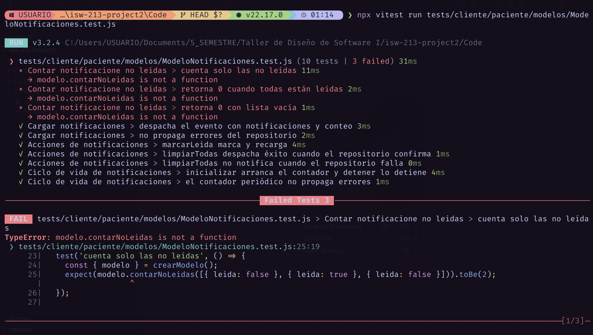

---

**Commit 2 — Verde** [`54229c1`](https://github.com/alejandroramirezucb/isw-213-project2/commit/54229c1):

```
feat: [HU-09] implementar contarNoLeidas para pasar test
```

Código mínimo:

```javascript
contarNoLeidas(notificaciones) {
  let total = 0;
  for (let i = 0; i < notificaciones.length; i++) {
    if (!notificaciones[i].leida) {
      total = total + 1;
    }
  }
  return total;
}
```

> Captura del test pasando:

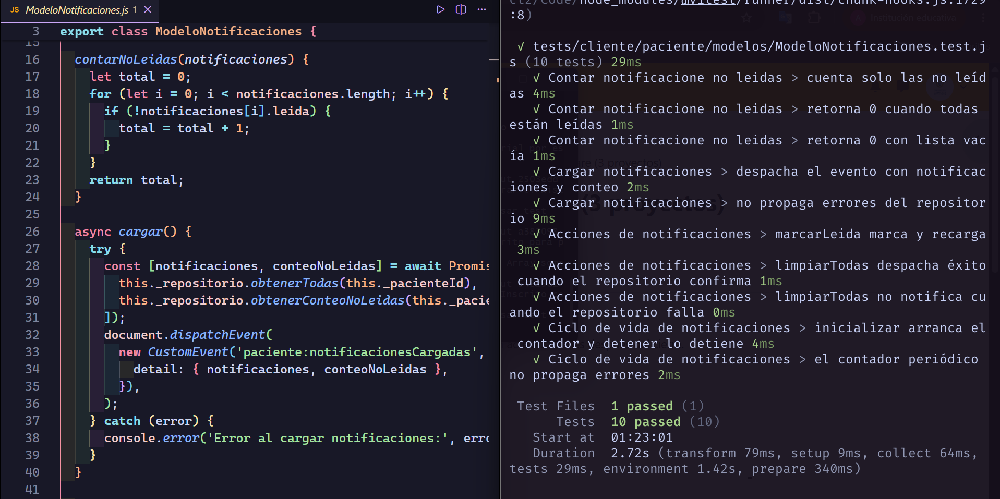

---

**Commit 3 — Refactor** [`e020851`](https://github.com/alejandroramirezucb/isw-213-project2/commit/e020851):

```
refactor: [HU-09] simplificar contarNoLeidas con filter
```

Cambios aplicados:

```javascript
contarNoLeidas(notificaciones) {
  return notificaciones.filter((notificacion) => !notificacion.leida).length;
}
```

> Captura del test aún pasando después del refactor:

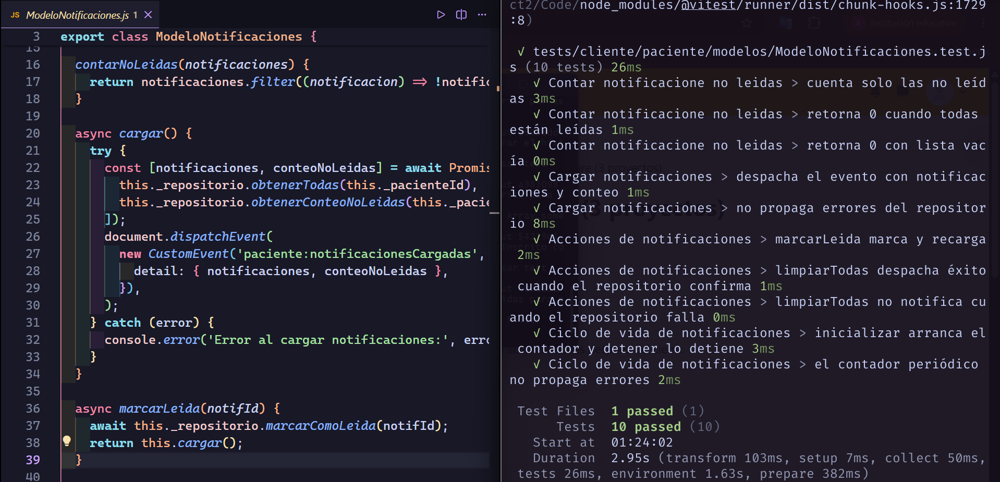

---

### Ciclo TDD — Prueba 3

**HU:** HU-13 Historial de Citas
> Como psicólogo, quiero ver un registro de las citas pasadas de un paciente específico para saber cuántas veces ha asistido o cancelado.

**CA elegido:** Dado el historial de citas de un paciente, cuando el psicólogo filtre por un estado (Completada, Cancelada, Ausente), entonces el sistema debe devolver solo las citas que coinciden con ese estado.

**Commit 1 — Rojo** [`14875b2`](https://github.com/alejandroramirezucb/isw-213-project2/commit/14875b2):

```
test: [HU-13] agregar test para filtrar el historial por estado de cita
```

Test escrito (sin el código que lo pase aún):

```javascript
import { describe, test, expect } from 'vitest';
import { ModeloHistorial } from '../../../../src/cliente/psicologo/modelos/ModeloHistorial.js';

function crearModelo() {
  return new ModeloHistorial({}, {});
}

const CITAS = [
  { estado: 'completada' },
  { estado: 'cancelada' },
  { estado: 'completada' },
  { estado: 'ausente' },
];

describe('HU-13 Historial de citas por estado', () => {
  test('filtra las citas completadas', () => {
    // Arrange: CITAS = 4 citas (2 completada, 1 cancelada, 1 ausente), estado = 'completada'
    const modelo = crearModelo();

    // Act
    const resultado = modelo.filtrarPorEstado(CITAS, 'completada');

    // Assert
    expect(resultado).toHaveLength(2);
  });

  test('retorna una lista vacía cuando no hay coincidencias', () => {
    // Arrange: CITAS = 4 citas (2 completada, 1 cancelada, 1 ausente), estado = 'inexistente'
    const modelo = crearModelo();

    // Act
    const resultado = modelo.filtrarPorEstado(CITAS, 'inexistente');

    // Assert
    expect(resultado).toEqual([]);
  });
});
```

> Captura del test fallando:

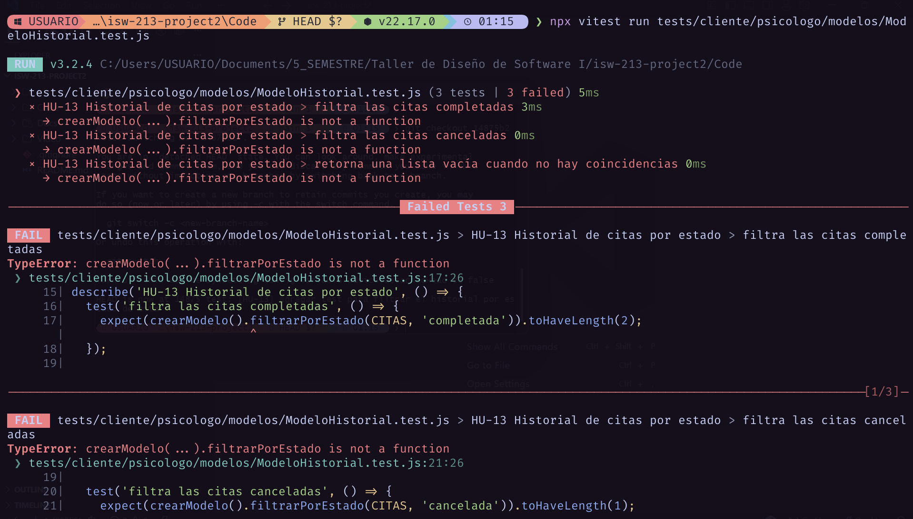

---

**Commit 2 — Verde** [`dce797c`](https://github.com/alejandroramirezucb/isw-213-project2/commit/dce797c):

```
feat: [HU-13] implementar filtrarPorEstado para pasar test
```

Código mínimo:

```javascript
filtrarPorEstado(citas, estado) {
  const resultado = [];
  for (let i = 0; i < citas.length; i++) {
    if (citas[i].estado === estado) {
      resultado.push(citas[i]);
    }
  }
  return resultado;
}
```

> Captura del test pasando:

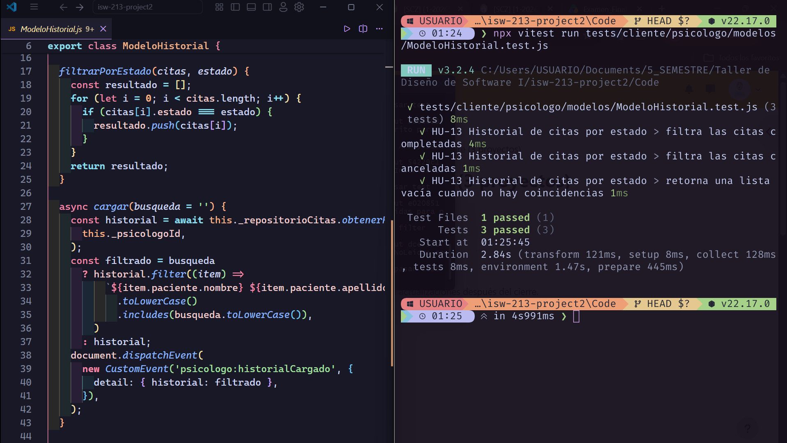

---

**Commit 3 — Refactor** [`39b4c28`](https://github.com/alejandroramirezucb/isw-213-project2/commit/39b4c28):

```
refactor: [HU-13] simplificar filtrarPorEstado con filter
```

Cambios aplicados:

```javascript
filtrarPorEstado(citas, estado) {
  return citas.filter((cita) => cita.estado === estado);
}
```

> Captura del test aún pasando después del refactor:

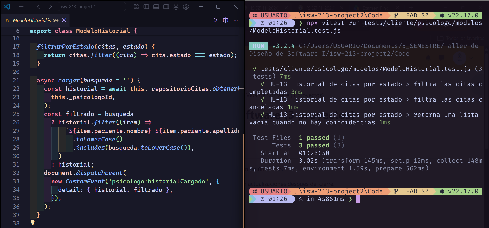

---

### Cobertura final

**Cobertura alcanzada:** 99.5% statements / 97.64% ramas / 96.61% funciones / 100% líneas, con 88 pruebas verdes (10 archivos de test).

> Captura del reporte de cobertura final (`npm run test:coverage`):

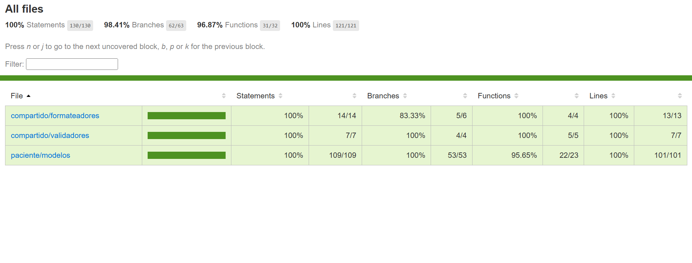

| Archivo / paquete | % Stmts | % Branch | % Funcs | % Lines |
|---|---:|---:|---:|---:|
| cliente/compartido/formateadores/FormateadorFecha.js | 100 | 75 | 100 | 100 |
| cliente/compartido/formateadores/FormateadorHora.js | 100 | 100 | 100 | 100 |
| cliente/compartido/validadores/ValidadorFormulario.js | 100 | 100 | 100 | 100 |
| cliente/paciente/modelos/ModeloCancelacion.js | 100 | 100 | 100 | 100 |
| cliente/paciente/modelos/ModeloListaEspera.js | 100 | 100 | 100 | 100 |
| cliente/paciente/modelos/ModeloNotificaciones.js | 96 | 75 | 90 | 100 |
| cliente/paciente/modelos/ModeloPerfil.js | 100 | 100 | 100 | 100 |
| cliente/paciente/modelos/ModeloReprogramacion.js | 100 | 100 | 100 | 100 |
| cliente/paciente/modelos/ModeloReserva.js | 100 | 100 | 94.44 | 100 |
| **Todos los archivos** | **99.5** | **97.64** | **96.61** | **100** |

#### Justificación

**Qué cubren las pruebas:**

El `include` de cobertura (`vitest.config.js`) solo cubre la lógica de negocio, se excluyen repositorios, vistas, controladores, config y el servidor. El alcance es:

- Modelos del paciente: `ModeloReserva`, `ModeloListaEspera`, `ModeloNotificaciones`, `ModeloPerfil`, `ModeloCancelacion`, `ModeloReprogramacion`.
- Utilidades compartidas: `ValidadorFormulario`, `FormateadorFecha`, `FormateadorHora`.

**La cobertura es alta porque:**

- Son módulos que reciben datos y devuelven un resultado (validaciones, conteos, filtrados, mapeo de errores).
- Sus dependencias (repositorios, `document`) se inyectan y se sustituyen por dobles (`vi.fn()`) que estan en `tests/helpers/dobles.js` y `tests/helpers/eventos.js`, así que cada rama se puede recorrer sin la base de datos.

**Qué no se cubre:**

- `**/repositorios/**` porque solo se mockean, no tienen logica de negocio.
- `**/vistas/**` y `**/controladores/**` porque solo manipulan el DOM, y tampoco tienen logica de negocio
- `src/servidor/**`, `**/config/**`, `**/gestores/**`, `inicio.js`, `Aplicacion*.js` porque son infraestructura, y no tienen reglas de negocio.
- Las ramas no cubiertas que sí tienen lógica de negocio (comprobación `typeof fecha === 'string'` en `FormateadorFecha.js:17`, comprobación de `this._intervalo` antes de llamar `clearInterval` en `ModeloNotificaciones.js:59`, que evita limpiar un intervalo nunca asignado) son caminos de error de baja prioridad.

---

## Sección 3 — Code smells corregidos

| #   | Tipo            | Commit                                                                                          | Descripción                                                                                                                                  |
| --- | --------------- | ----------------------------------------------------------------------------------------------- | --------------------------------------------------------------------------------------------------------------------------------------------- |
| 1   | Long Method     | [`5c2c777`](https://github.com/alejandroramirezucb/isw-213-project2/commit/5c2c777)             | Antes `ModeloReserva.confirmar()` tenía 6 responsabilidades mezcladas y ahora son 18 líneas que delegan en 6 métodos privados.   |
| 2   | Magic Numbers   | [`4c86312`](https://github.com/alejandroramirezucb/isw-213-project2/commit/4c86312)             | Antes los códigos HTTP estaban hardcodeados y ahora se usan constantes en `CodigosHttp.js`. |
| 3   | Duplicate Code  | [`66347a1`](https://github.com/alejandroramirezucb/isw-213-project2/commit/66347a1)             | Antes `document.dispatchEvent(new CustomEvent())` se repetía en 7 lugares y ahora todos pasan por el helper `_dispatch`. |

### Detalle — Smell 1: Long Method

`ModeloReserva.confirmar()` tenia validación, cancelación, obtención de profesional,
creación de cita, notificaciones y manejo de errores en un solo método.

**Código antes:**

```javascript
async confirmar(esReprogramacion = false, citaAnterior = null) {
  if (this._confirmando) return;
  if (!this._bloqueId || !this._pacienteId) {
    return this._enviarMensajeError('Error: datos de reserva incompletos');
  }
  if (this._usuario?.pacientes?.bloqueado) {
    this._enviarMensajeError('No es posible agendar en este momento');
    return document.dispatchEvent(new CustomEvent('paciente:reservaCerrarModal'));
  }
  this._confirmando = true;
  try {
    if (esReprogramacion && citaAnterior) {
      await this._repositorioCitas.cancelar(citaAnterior);
    }
    const bloque = await this._repositorioBloques.obtenerProfesional(this._bloqueId)
      .catch(async (err) => { await this._repositorioBloques.liberarTemporal(this._bloqueId); throw err; });
    if (!bloque?.psicologo_id) throw new Error('Bloque no válido');
    let citaId;
    try {
      citaId = await this._repositorioCitas.crear(this._pacienteId, bloque.psicologo_id, this._bloqueId);
    } catch (e) {
      await this._repositorioBloques.liberarTemporal(this._bloqueId);
      throw e;
    }
    if (!citaId) throw new Error('Error al crear cita');
    // ...
  } finally {
    this._confirmando = false;
  }
}
```

**Código después:**

```javascript
async confirmar(esReprogramacion = false, citaAnterior = null) {
  if (this._confirmando) return;
  if (!this._datosReservaValidos()) return;

  this._confirmando = true;
  try {
    if (esReprogramacion && citaAnterior) {
      await this._repositorioCitas.cancelar(citaAnterior);
    }
    const bloque = await this._obtenerBloqueProfesional();
    const citaId = await this._crearCita(bloque.psicologo_id);
    await this._notificarNuevoTurno(bloque.psicologo_id, citaId);
    this._anunciarReservaExitosa(esReprogramacion);
  } catch (e) {
    this._anunciarReservaFallida(e);
  } finally {
    this._confirmando = false;
  }
}
```

Cada responsabilidad ahora esta en su propio método (`_datosReservaValidos`,
`_obtenerBloqueProfesional`, `_crearCita`, `_notificarNuevoTurno`, `_anunciarReservaExitosa`,
`_anunciarReservaFallida`).

---

### Detalle — Smell 2: Magic Numbers

Los códigos de estado HTTP estaban como números mágicos en `Servidor.js` y
`ControladorRegistro.js`.

**Código antes:**

```javascript
if (!datos) return this.responder(res, 400, { error: 'JSON inválido' });
if (authResult.status === 422) return this._manejarUsuarioExistente(res, datos);
if (authResult.status >= 400) { /* ... */ }
this.responder(res, 200, { ok: true });
```

**Código después:** 

```javascript
export const CodigosHttp = {
  OK: 200, MINIMO_REDIRECCION: 300, REDIRECCION: 302,
  PETICION_INVALIDA: 400, NO_ENCONTRADO: 404, CONFLICTO: 409,
  ENTIDAD_NO_PROCESABLE: 422, ERROR_SERVIDOR: 500,
};

if (!datos) return this.responder(res, CodigosHttp.PETICION_INVALIDA, { error: 'JSON inválido' });
if (authResult.status === CodigosHttp.ENTIDAD_NO_PROCESABLE) return this._manejarUsuarioExistente(res, datos);
this.responder(res, CodigosHttp.OK, { ok: true });
```

---

### Detalle — Smell 3: Duplicate Code

`ModeloReserva` ya tenía un helper `_dispatch(evento, detail)`, pero 7 partes del código
seguían lanzando eventos con`document.dispatchEvent(new CustomEvent())`. Y el evento `paciente:bloqueNoDisponible` tiene codigo duplicado en dos ramas de `seleccionarBloque`.

**Código antes:**

```javascript
document.dispatchEvent(
  new CustomEvent('paciente:bloqueNoDisponible', { detail: { fecha } }),
);

document.dispatchEvent(
  new CustomEvent('paciente:reservaConfirmada', {
    detail: { esReprogramacion, fecha: this._fecha },
  }),
);
```

**Código después:** 

```javascript
this._dispatch('paciente:bloqueNoDisponible', { fecha });
this._dispatch('paciente:reservaConfirmada', { esReprogramacion, fecha: this._fecha });
```

Ahora solo esta`document.dispatchEvent` en todo el archivo (dentro de `_dispatch`),
asi que ya no hay duplicación. 

---

## Sección 4 — Trazabilidad HU → CA → test

| #   | Historia de Usuario            | Criterio de Aceptación                                                                 | Prueba que valida ese CA                                          | Commit                                                                              |
| --- | ------------------------------ | -------------------------------------------------------------------------------------- | ---------------------------------------------------------------- | ----------------------------------------------------------------------------------- |
| 1   | HU-14 Lista de Espera          | Dado un paciente ya inscrito, cuando intente anotarse de nuevo, entonces no se duplica | `Ya esta inscrito en la lista de espera › retorna true cuando el paciente ya está en la lista` | [`1cf8995`](https://github.com/alejandroramirezucb/isw-213-project2/commit/1cf8995) |
| 2   | HU-09 Notificación de Reserva  | Dado un conjunto de notificaciones, cuando se calcule el indicador, entonces cuenta solo `leida = false` | `Contar notificacione no leidas › cuenta solo las no leídas`     | [`7ee8b09`](https://github.com/alejandroramirezucb/isw-213-project2/commit/7ee8b09) |
| 3   | HU-13 Historial de Citas       | Dado el historial, cuando el psicólogo filtre por estado, entonces devuelve solo las de ese estado | `HU-13 Historial de citas por estado › filtra las citas completadas` | [`14875b2`](https://github.com/alejandroramirezucb/isw-213-project2/commit/14875b2) |

### Cadena 1 — HU-14 Lista de Espera

**Historia de Usuario:**
> Como paciente, quiero entrar a una lista de espera si un día está completamente lleno, para que me avisen si alguien cancela.

**Criterio de Aceptación elegido:**
> Dado que un paciente ya está anotado en la lista de espera de un día, cuando intente anotarse de nuevo, entonces el sistema debe detectar que ya está inscrito y no duplicar la inscripción.

**Prueba que valida este CA** (`tests/cliente/paciente/modelos/ModeloListaEspera.test.js`):

```javascript
test('retorna true cuando el paciente ya está en la lista', () => {
  // Arrange: inscritos = [{paciente_id:'paciente-9'}, {paciente_id:'paciente-1'}], pacienteId = 'paciente-1' 
  const { modelo } = crearModelo();
  const inscritos = [{ paciente_id: 'paciente-9' }, { paciente_id: 'paciente-1' }];

  // Act
  const resultado = modelo.yaEstaInscrito(inscritos, 'paciente-1');

  // Assert
  expect(resultado).toBe(true);
});
```

---

### Cadena 2 — HU-09 Notificación de Confirmación de Reserva

**Historia de Usuario:**
> Como paciente, quiero recibir una notificación al momento de agendar para tener un comprobante y los detalles exactos de mi turno.

**Criterio de Aceptación elegido:**
> Dado un conjunto de notificaciones del paciente, cuando el sistema calcule el numero de notificaciones no leídas, entonces debe contar únicamente las notificaciones cuyo campo `leida` es falso.

**Prueba que valida este CA** (`tests/cliente/paciente/modelos/ModeloNotificaciones.test.js`):

```javascript
test('cuenta solo las no leídas', () => {
  // Arrange: notificaciones = [{leida:false}, {leida:true}, {leida:false}] 
  const { modelo } = crearModelo();
  const notificaciones = [{ leida: false }, { leida: true }, { leida: false }];

  // Act
  const total = modelo.contarNoLeidas(notificaciones);

  // Assert
  expect(total).toBe(2);
});
```

---

### Cadena 3 — HU-13 Historial de Citas

**Historia de Usuario:**
> Como psicólogo, quiero ver un registro de las citas pasadas de un paciente específico para saber cuántas veces ha asistido o cancelado.

**Criterio de Aceptación elegido:**
> Dado el historial de citas de un paciente, cuando el psicólogo filtre por un estado (Completada, Cancelada, Ausente), entonces el sistema debe devolver solo las citas que coinciden con ese estado.

**Prueba que valida este CA** (`tests/cliente/psicologo/modelos/ModeloHistorial.test.js`):

```javascript
test('filtra las citas completadas', () => {
  // Arrange: CITAS = 4 citas (2 completada, 1 cancelada, 1 ausente), estado = 'completada'
  const modelo = crearModelo();

  // Act
  const resultado = modelo.filtrarPorEstado(CITAS, 'completada');

  // Assert
  expect(resultado).toHaveLength(2);
});
```
